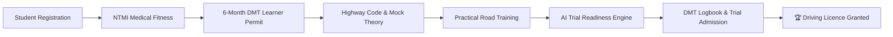

# TrialReady LK 🇱🇰
> **AI-Assisted Driving Academy Management & DMT Practical Trial Readiness System**  
> *Engineered for Sri Lankan Driving Schools & Motor Traffic Regulatory Compliance*

[](https://github.com/ravishkarathnayaka/TrialReady-LK)
[](https://github.com/ravishkarathnayaka/TrialReady-LK)
[](https://www.typescriptlang.org/)
[](https://react.dev/)
[](https://tailwindcss.com/)
[](https://supabase.com/)
[](https://vitest.dev/)

---

## 📖 Executive Overview

**TrialReady LK** is a specialized, production-ready enterprise management platform tailored specifically to the operational, legal, and educational requirements of **Sri Lankan Driving Schools** (*Motor Traffic Act No. 14 of 1951*).

The platform digitizes the entire student lifecycle—from initial registration, **NTMI medical fitness verification**, and **6-month DMT Learner's Permit countdown**, through structured practical training and **AI-driven trial readiness assessment**, culminating in automated **print-ready Official DMT Practical Training Logbooks** and **Trial Day Admission Passes**.



---

## 🌟 Key Platform Features

### 1. 🎯 AI-Assisted Trial Readiness Engine
* **6-Factor Scientific Scoring Algorithm (0–100%)**:
  * NTMI Medical Fitness Clearance (15 pts)
  * DMT Learner's Permit Validity & Expiry Check (15 pts)
  * DMT Computerized Theory Exam Status (15 pts)
  * Logged Practical Road Hours & Lessons (25 pts)
  * Core DMT Maneuver Mastery Checklist (20 pts)
  * Instructor Practical Evaluation Ratings (10 pts)
* **Readiness Tiers**: `🏆 Trial Ready` (85%+), `⚡ Nearly Ready` (70–84%), `🚗 Needs Practice` (50–69%), `⚠️ Not Ready` (<50%).
* **Action Roadmaps & Risk Warnings**: Highlights expired permits, missing maneuvers (Hill Start, Reverse S-Bend), and outstanding fees.

### 2. 🎓 7-Stage Learner Journey Compliance Pipeline
* Step-by-step visual tracker enforcing DMT legal prerequisites:
  1. Registration & Enrolment
  2. NTMI Medical Fitness (National Transport Medical Institute)
  3. DMT 6-Month Learner's Permit (Dynamic expiry countdown & alert engine)
  4. Computerized Theory Examination
  5. Practical Road Training Lessons (10–15 Hours standard)
  6. Official DMT Practical Trial Exam (Werahera / Regional Grounds)
  7. Permanent Driving Licence Issuance

### 3. 📄 Official DMT Candidate Logbook & Trial Pass Generator
* **A4 Print-Optimized Official Practical Training Logbook (`DMT/SL/LOG-01`)**:
  * Academy header & official seal docket
  * Candidate NIC, permit, and medical verification blocks
  * Chronological session history with vehicle reg, instructor, maneuvers, and star ratings
  * Principal Instructor certification & signature blocks
* **Trial Day Candidate Admission Slip (`DMT/SL/ADM-PASS`)**:
  * Candidate trial docket, reporting time, test ground, test vehicle
  * Required documents checklist (Original NIC, Permit, Medical, Logbook, Photos)
  * **DMT Examiner On-Site Evaluation Scorecard (8 core maneuvers)**

### 4. 🌐 Trilingual DMT Highway Code & Mock Exam Simulator (EN / SI / TA)
* **Trilingual Theory Practice Hub**: Instant switching between **English**, **සිංහල (Sinhala)**, and **தமிழ் (Tamil)**.
* **40-Question Timed Mock Exam**: Real Sri Lanka DMT exam simulation with immediate feedback, explanations, and score certificates.
* **Interactive Road Signs Flashcards**: Mandatory, warning, and informative road signs categorized by DMT regulatory standards.

### 5. 💳 Tuition Packages & Financial Revenue Ledger
* Course package management (Manual, Auto, Dual-purpose, Heavy vehicles).
* Flexible fee instalment tracking with real-time balance calculations.
* Sri Lankan Rupee (`LKR`) formatting and printable branded payment receipts.

### 6. 📊 Executive Analytics & DMT Audit Export Suite
* Real-time practical trial pass rate benchmarks (First-attempt vs. Repeat attempts).
* Trial failure root-cause analysis (Hill Start Rollback, Reverse S-Bend, Parallel Parking).
* Instructor performance rankings and vehicle fleet utilization rates.
* **One-Click RFC-4180 UTF-8 CSV Audit Logs** with Excel BOM compatibility.

### 7. 🔔 Automated Expiry Alerts & Academy Notice Board
* Dynamic alert engine for:
  * DMT Learner Permits expiring within 30 days
  * Expired NTMI Medical Certificates
  * Overdue fee instalments
* Academy-wide Notice Board for operational scheduling announcements.

### 8. 🌱 1-Click In-App Demo Seeder
* Instantly seeds the database with:
  * **Royal Driving Academy** (DS-WP-2026-0042) with 3 branches (Nugegoda, Kandy, Gampaha)
  * 4 qualified instructors & 5 training vehicles (Dual-control Manual/Auto)
  * 5 diverse student personas spanning all 4 AI readiness tiers
  * Complete financial ledgers and mock exam attempts

---

## 🏛️ System Architecture

```mermaid
graph TD
    Client[React 19 + TypeScript + Tailwind CSS] --> Routing[React Router v7 Protected Routes]
    Routing --> Contexts[AuthContext | TheoryLanguageContext]
    Contexts --> Features[Feature Modules]
    
    subgraph "Application Core"
        Features --> J[Learner Journey]
        Features --> R[AI Readiness Engine]
        Features --> T[Theory Practice & Mock Exam]
        Features --> L[DMT Logbook & Slips]
        Features --> F[Financial Ledger]
        Features --> A[Executive Analytics]
    end
    
    Features --> SupabaseClient[Supabase JS Client]
    SupabaseClient --> Auth[Supabase Auth / JWT]
    SupabaseClient --> DB[(PostgreSQL Database + RLS Policies)]
```

---

## 👥 Role-Based Access Control (RBAC)

| Role | Access Scope |
| :--- | :--- |
| **Administrator** | Full system control: Student management, staff rosters, vehicle fleet, financial ledger, executive analytics, branch settings, DMT audit exports. |
| **Instructor** | Dedicated portal: Today's training agenda, assigned student roster, practical attendance logging, skill checklist rating, trial readiness review. |
| **Student** | Learner portal: 6-month permit countdown, medical status, upcoming lesson schedule, payment balance, personal DMT logbook, trial admission pass. |

---

## 🛠️ Technology Stack

| Area | Technologies |
| :--- | :--- |
| **Frontend UI** | React 19, TypeScript 5.x, Vite 7.x, Tailwind CSS 4.x |
| **Routing & Icons** | React Router v7, Lucide React |
| **State Management** | React Context API (`AuthContext`, `TheoryLanguageContext`) |
| **Backend & Database** | Supabase (PostgreSQL 15), Row Level Security (RLS) |
| **Testing Suite** | Vitest, React Testing Library, jsdom, `@testing-library/jest-dom` |
| **Document Generation** | Browser-native `@media print` CSS for pixel-perfect A4 printing / PDF export |

---

## 🚀 Quick Start Guide

### Prerequisites
* **Node.js**: `v20.x` or higher
* **npm**: `v10.x` or higher

### 1. Clone the Repository
```bash
git clone https://github.com/ravishkarathnayaka/TrialReady-LK.git
cd TrialReady-LK
```

### 2. Install Dependencies
```bash
cd frontend
npm install
```

### 3. Configure Environment Variables
Create `frontend/.env.local`:
```env
VITE_SUPABASE_URL=https://your-project.supabase.co
VITE_SUPABASE_PUBLISHABLE_KEY=your-publishable-key
```

### 4. Run Automated Test Suite
```bash
npm test
```
*Expected: **36 / 36 tests passing** across 7 test suites.*

### 5. Launch Development Server
```bash
npm run dev
```
Open **`http://localhost:5173`** in your browser.

### 6. Seed Demo Data
Click the **`🌱 Demo Data`** button in the top navigation header to populate complete driving academy records in one click.

---

## 🧪 Automated Test Coverage

The project maintains an automated unit & integration test suite using **Vitest**:

```text
 ✓ src/features/financials/utils/financialUtils.test.ts (7 tests)
 ✓ src/features/journey/utils/journeyUtils.test.ts (8 tests)
 ✓ src/features/readiness/utils/readinessEngine.test.ts (6 tests)
 ✓ src/features/theory/context/TheoryLanguageContext.test.tsx (3 tests)
 ✓ src/features/notifications/utils/alertEngine.test.ts (6 tests)
 ✓ src/features/analytics/utils/analyticsEngine.test.ts (4 tests)
 ✓ src/features/logbook/types/logbook.test.ts (2 tests)

Test Files  7 passed (7)
     Tests  36 passed (36)
  Duration  2.59s
```

---

## 📄 Regulatory Compliance

This software is designed in strict alignment with:
1. **Motor Traffic Act No. 14 of 1951 (Sri Lanka)**
2. **Department of Motor Traffic (DMT) Sri Lanka** Learner Permit & Practical Trial Standards
3. **National Transport Medical Institute (NTMI)** Fitness Examination Requirements

---

## 👨‍💻 Project Contributors

* **Ravishka Rathnayaka** — *BSc (Hons) in Cyber Security*
* **Loshan Mihisara** — *Collaborator & Code Reviewer*
* **Lasindu Dilshan** — *Collaborator & Code Reviewer*
* **Manur Anuhas** — *Collaborator & Code Reviewer*

---

## 📜 Licence

This project is developed for academic and commercial evaluation under the **MIT Licence**.