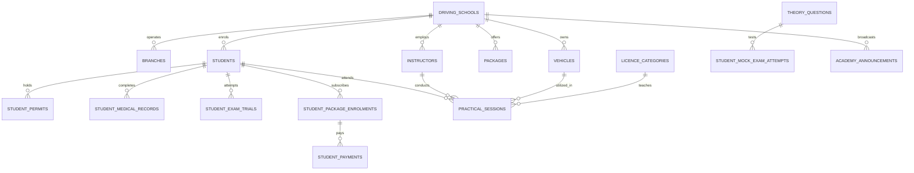

# System Architecture — TrialReady LK

> **Document Version:** 1.0.0  
> **Author:** Ravishka Rathnayaka (*BSc Hons in Cyber Security*)  
> **System Scope:** Sri Lankan Driving Academy Management & AI Trial Readiness Engine

---

## 1. Architectural Overview

**TrialReady LK** is built on a modern, decoupled cloud architecture designed for high availability, data integrity, and strict multi-tenant isolation per driving academy.

```mermaid
graph TB
    subgraph "Presentation Layer (React 19 SPA)"
        UI[Tailwind CSS 4.x Design System]
        Router[React Router v7 / Protected Gates]
        AuthCtx[Auth Context & Role Gatekeeper]
        LangCtx[Trilingual Theory Context (EN/SI/TA)]
        Views[17 Domain Feature Modules]
    end

    subgraph "Client Services & Business Logic Layer"
        ReadinessEngine[AI Readiness Engine (0-100%)]
        JourneyPipeline[7-Stage DMT Compliance Pipeline]
        FinancialLedger[Financial & Receipt Calculator]
        ExportEngine[RFC-4180 CSV & Audit Exporter]
        LogbookGen[DMT Logbook & Admission Pass Generator]
    end

    subgraph "Backend as a Service (Supabase Cloud)"
        SupaAuth[Supabase Auth / JWT Engine]
        PostgreSQL[(PostgreSQL 15 Database)]
        RLS[Row Level Security (RLS) Policies]
    end

    UI --> Router
    Router --> AuthCtx
    Router --> Views
    Views --> ReadinessEngine
    Views --> JourneyPipeline
    Views --> FinancialLedger
    Views --> ExportEngine
    Views --> LogbookGen
    
    ReadinessEngine --> PostgreSQL
    JourneyPipeline --> PostgreSQL
    FinancialLedger --> PostgreSQL
    ExportEngine --> PostgreSQL
    LogbookGen --> PostgreSQL
    AuthCtx --> SupaAuth
    PostgreSQL --- RLS
```

---

## 2. Database Schema & Entity Relationships

The relational model consists of **17 tables** structured around multi-tenant academy segregation (`driving_school_id` foreign keys enforced by RLS):



---

## 3. Security & Cyber Security Architecture

As a project developed within a **BSc (Hons) in Cyber Security**, the platform incorporates multiple defensive layers:

### 3.1 Authentication & Session Management
* **JWT Token Authentication**: Secure token verification managed via Supabase GoTrue.
* **Role-Based Access Control (RBAC)**: Enforces three distinct privilege tiers:
  * `administrator`: Unrestricted CRUD access to school data, financials, analytics, staff, and audit records.
  * `instructor`: Scoped access to assigned practical sessions, student rosters, and attendance/skill evaluations.
  * `student`: Strictly isolated read access to personal permit, medical, financial balance, and document generators.

### 3.2 Database Multi-Tenancy & Row Level Security (RLS)
* Every table query is filtered by `driving_school_id = auth.jwt()->>'driving_school_id'`.
* Ensures complete data segregation between competing driving schools sharing the platform.

### 3.3 Data Validation & Sanitization
* All CSV exports implement RFC-4180 quoting and character sanitation to eliminate CSV Injection (Formula Injection) vulnerabilities (`=`, `+`, `-`, `@`).
* Strict TypeScript interfaces eliminate type confusion and prototype poisoning.

---

## 4. Business Logic Engines

### 4.1 AI-Assisted Trial Readiness Algorithm
The evaluation engine processes dynamic candidate metrics into a weighted 100-point composite score:

$$\text{Readiness Score} = S_{\text{medical}} (15) + S_{\text{permit}} (15) + S_{\text{theory}} (15) + S_{\text{hours}} (25) + S_{\text{skills}} (20) + S_{\text{rating}} (10)$$

* **Permit Validity Factor**: Computes active days remaining; triggers a 0-point penalty and critical blocker if permit has passed its 6-month DMT validity.
* **Skills Mastery Factor**: Validates coverage of all 7 mandatory DMT Sri Lanka practical maneuvers (Hill Start, Reverse S-Bend, Parallel Parking, 3-Point Turn, Clutch Control, Lane Discipline, Emergency Braking).

### 4.2 Trilingual Context Engine
The Highway Code practice hub utilizes a custom React Context provider with persistent language tokens (`en`, `si`, `ta`). When localized question tokens are requested, the engine matches the active language schema while providing zero-overhead fallback to English if translations are missing.

### 4.3 Browser-Native Print Layout Architecture
Document generation (Logbooks and Admission Passes) utilizes pure `@media print` CSS styling. This eliminates heavy third-party client PDF libraries, guaranteeing zero PDF rendering vulnerabilities, crisp vector typography, and instant rendering on both desktop and mobile web browsers.
